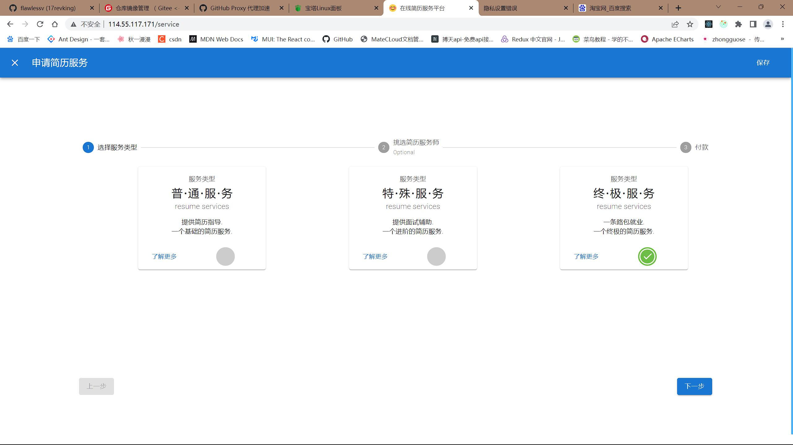

## 项目展示

#### 首页

#### 登录与注册

#### 简历模板大全

#### 在线编辑简历（可下载）

#### 简历服务（可下载）

#### 名企热招

#### 我的

#### 项目介绍
　　　该平台为学院工作室项目，前端由我一人从 0 到 1 独立开发，后端由工作室 Java 好友开发。一共由十几个前端页面组成，用户可在该平台挑选简历模板，在线编辑简历，下载简历，也可以在线咨询简历服务师来指导代写、优化简历等服务。

技术栈
　　　前端：React18+axios+mui+antd+reduxjs/toolkit+websocket+styled-components
后端：SpringCloudAlibaba+SpringBoot +Nacos+Seata+Gateway+Sentinel+Mybatis-plus+Redis
项目功能
登录/注册：提供三种登录方式，用户可通过用户名+密码+图片验证码登录或手机号/邮箱+验证码登录或注册,使用双 token 进行身份验证实现无感刷新
封装aixos：对aixos进行二次封装，拦截请求和响应并根据token的情况作出判断和对应操作，重写aixos的各种方法，对项目中所有用到网络请求的函数进行统一管理
编辑简历：通过统一封装组件input或makedown输入框，监听其变化并dispatch到store中，使
用户可在线编辑简历并在其选择的模板上实时显示简历编辑内容
简历服务：用户可在线选择服务的类型与不同的简历服务师，下单后即可通过聊天框在线与简历服务师对话的页面也可修改、删除、评价订单
上传简历模板：用户可以上传自己喜欢的模板供别人使用，并且从中获取收益。
项目特点
　　　使用 CSS in JS 技术实现 CSS 模块化，对公共样式进行抽离混入，通过 props 实现对指定组件在不同页面的展示情况
各种组件抽离及其细致化，自定义 hooks，项目目录划分清晰代码规范，使用路由表统一管理路由，网络请求与数据存储完全与结构样式相分离
组件使用 memo 包裹，使用 useCallback 提升性能优化，使组件实现最小原子渲染
Websocket 使用心跳机制，检测客户端和服务端是否处于正常连接状态